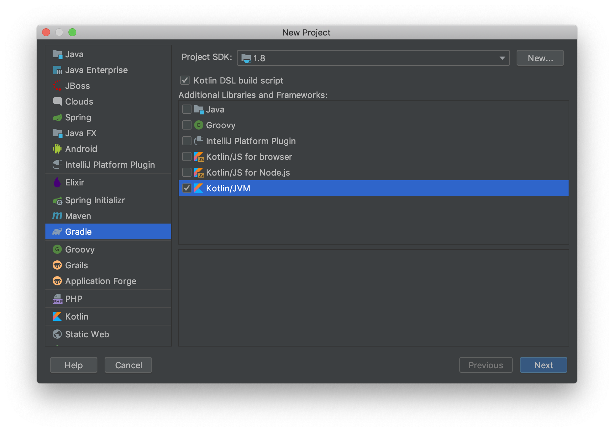
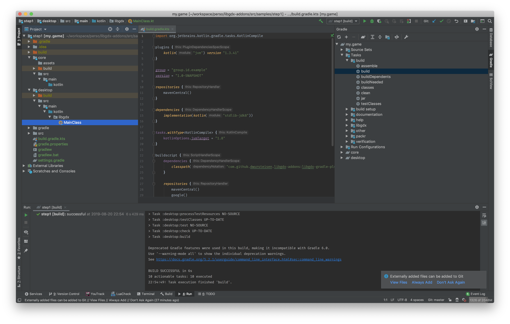
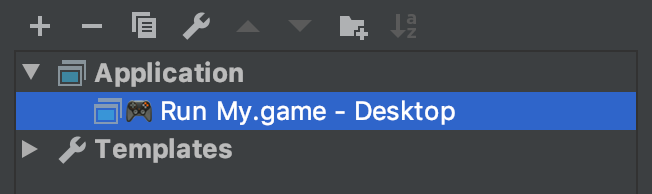
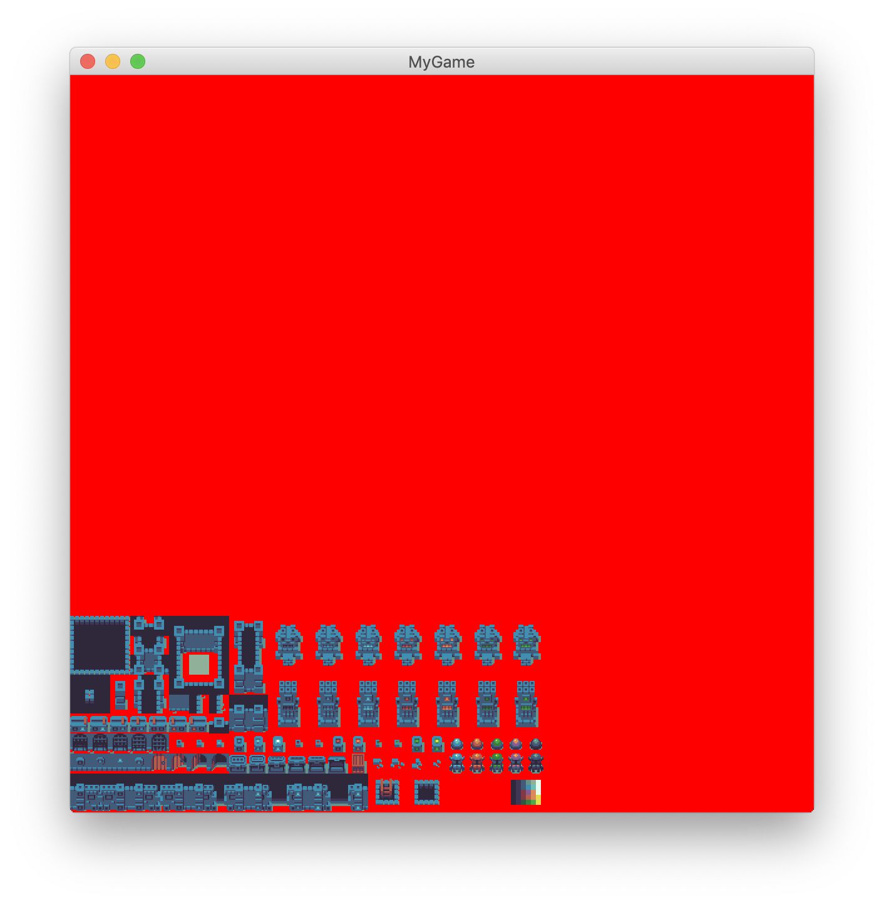
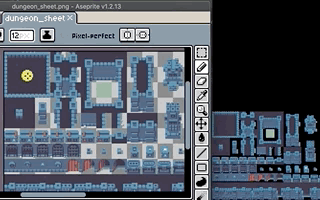

== Getting started

LibGDX use https://gradle.org[gradle] as a build system.
You can use the https://libgdx.badlogicgames.com/download.html[official setup app] to create your game.
Instead  LibGDX-addons propose a gradle plugin to take care of all gradle setup,
for all platform (Currently supported: Desktop and Android) so you don't have to manage it or update
your gradle script.

=== Setup your game

Create your first game by using https://www.jetbrains.com/idea/[IntelliJ].
Click in `File` > `New Project`

Pick `Gradle` then tick `Kotlin DSL build script`, choose `Kotlin/JVM` and go to the next screen by clicking `Next`.

image::media/create_game_02.png[]

Fill the information asked and click `Next` until IntelliJ create your project.

Open the file `build.gradle.kts` and paste this configuration into.
It adds necessary repositories for dependencies and add the https://github.com/dwursteisen/libgdx-addons/tree/master/libgdx-gradle-plugin[gradle libgdx plugin].

.build.gradle.kts
[source,kotlin,subs=attributes+]
----

buildscript {
    dependencies {
        classpath("com.github.dwursteisen.libgdx-addons:libgdx-gradle-plugin:016e8b7")
    }
    // <1>
    repositories {
        mavenCentral()
        google()
        jcenter()
        maven { url = uri("https://oss.sonatype.org/content/repositories/releases/") }
        maven { url = uri("https://oss.sonatype.org/content/repositories/snapshots/") }
        maven { url = uri("https://jitpack.io") }
    }
}

allprojects {
    // <2>
    repositories {
        mavenCentral()
        google()
        jcenter()
        maven { url = uri("https://oss.sonatype.org/content/repositories/releases/") }
        maven { url = uri("https://oss.sonatype.org/content/repositories/snapshots/") }
        maven { url = uri("https://jitpack.io") }
    }
}

apply(plugin = "libgdx")
----
<1> Add dependency repositories for plugins;
<2> Add dependency repositories for all modules.

Run the command `gradlew build`: it will download gradle if needed and download all dependencies and create the minimal setup.
Once done, it might be long depending of your Internet connection, refresh the project in IntelliJ.

=== Run your game

Your game project is now ready!

You can run the game from the command line using `./gradlew run`. Gradle will now compile the code that
was previously generated and run your game. But it might be more convenient to run the game from IntelliJ.

As you refreshed the project into IntelliJ, a new https://www.jetbrains.com/help/idea/creating-and-editing-run-debug-configurations.html[Run Configuration] just appear in your IntelliJ.
Click on `Add Configuration` and check `Application` run configurations. You will see a run configuration added in IntelliJ
to run your game.

=== Draw your first texture

Grab an image and copy it into the `src/main/assets` directory of the `core` module.
You can find free image / sprite sheet on the https://opengameart.org/content/a-blocky-dungeon[OpenGameArt.org].

Run the command `./gradlew build`, the command will generate a new class `Assets` that will
contains all of your assets name.

NOTE: The use of the `Assets` object is not mandatory. But if your rename one of your assets,
it's practical to have a compilation error instead of your game crashing.

Create your game into the `core` directory and use it in `MainClass.kt`.

.MyGame.kt
[source,kotlin]
----
include::samples/core/src/main/kotlin/step2/MyGame.kt[tags="body"]
----

.MainClass.kt
[source,kotlin]
----
include::samples/desktop/src/main/kotlin/step2/MainClass.kt[tags="body"]
----

If you run your game, the texture will be displayed on the screen.

=== Increase your feedback loop

It's important to have a quick feedback loop while developing a game.
For example, what's the point of restarting your game when you just updated
a texture from your game?

To enable this feature, you need to add a dependency to
the https://github.com/dwursteisen/libgdx-addons/tree/master/core-addons[libgdx core-addons].

Add this into your `build.gradle.kts` then refresh the project in your IDE:

.build.gradle.kts
[source,kotlin,subs=attributes+]
----
project(":core") {
    dependencies {
        implementation("com.github.dwursteisen.libgdx-addons:core-addons:{gitCommit}")
    }
}
----

You can now update your game to use the asset manager of libgdx with `RefreshableTexture`.

.MyGame.kt
[source,kotlin]
----
include::samples/core/src/main/kotlin/step3/MyGame.kt[tags="body"]
----
<1> Replace the default Texture Loader with the RefreshableTexture Loader;
<2> Force to load all assets before rendering the game;
<3> Clear the screen;
<4> Getting the texture from the asset manager.

Run your game and while the game is running, apply a modification on the texture file.
As soon as you save the file, the texture will be updated in your game.

NOTE: The asset manager is not mandatory. But by using it, you can use the `RefreshableTexture`
for the desktop version of your game and the default texture loader for your android game without
having to change your whole code base.

=== Setup a entity engine

A game is a lot of different entities who share a lot of common behaviours. For example, the player
and an enemy have bot a position. They have both a size too. You can create a class that both will
inherit. But it will increase your code complexity. Instead, you can compose your entities of different
properties: an entity can be a player with a size and a position. An enemy is an entity with a size, a position,
some other capacities.

[Ashley](https://github.com/libgdx/ashley) is one entity engine for libGDX. It is very easy to setup in your project.
Add ashley as dependencies of your project then refresh it in your IDE.

.build.gradle.kts
[source,kotlin,subs=attributes+]
----
project(":core") {
    dependencies {
        implementation("com.github.dwursteisen.libgdx-addons:core-addons:{gitCommit}")
        implementation("com.badlogicgames.ashley:ashley:{versionAshley}")
    }
}
----

The code of your game needs to be updated to add the entity engine and create your first entity.

.MyGame.kt
[source,kotlin]
----
include::samples/core/src/main/kotlin/step4/MyGame.kt[tags="body"]
----
<1> Create an `EntityEngine`. Please note that you can use a `PooledEntityEngine` too;
<2> Split the texture to get only a region. This region will be use to display the player;
<3> Create your first entity. This entity is marked as the `Player`. Has a position, a size, a texture and marked as to be rendered;
<4> Add all systems to the engine. For now, we will just add a system that will render all entities on screen;
<5> In the render loop, update the engine.

When creating the player, please note that only the component `Player` was created.

.Components.kt
[source,kotlin]
----
include::samples/core/src/main/kotlin/step4/Components.kt[]
----

Other components are provided by `ashley-addons`: `Position`, `Size`, …

IMPORTANT: Do not forget to set a size! Otherwise your entity will have a width and heigh
of 0 so will be invisible.

=== React to events

TIP: WIP

=== Create a state machine

TIP: WIP

=== Package your game for Desktop

TIP: WIP

=== Package your game for Android

TIP: WIP
